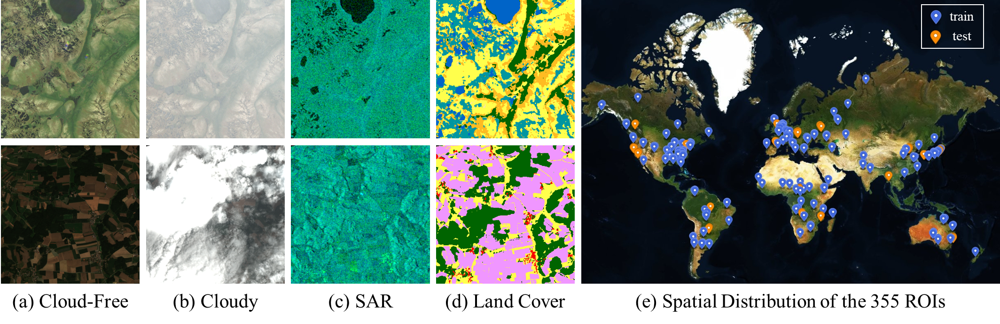

# Planet-CR: A Multi-Modal and Multi-Resolution Dataset for Cloud Removal in High Resolution Optical Remote Sensing Imagery

Planet-CR is the first public dataset for cloud removal to feature globally sampled high resolution optical observations, in combination with paired radar measurements as well as pixel-level land cover annotations. With this dataset, we consider the problem of cloud removal in high resolution optical remote sensing imagery by integrating multi-modal and multi-resolution information. We benchmark and in-depth analysis of representative cloud removal methods, highlighting the challenges and future research directions for high resolution remote sensing imagery cloud removal.

